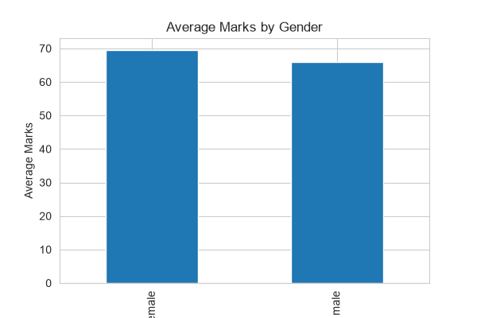
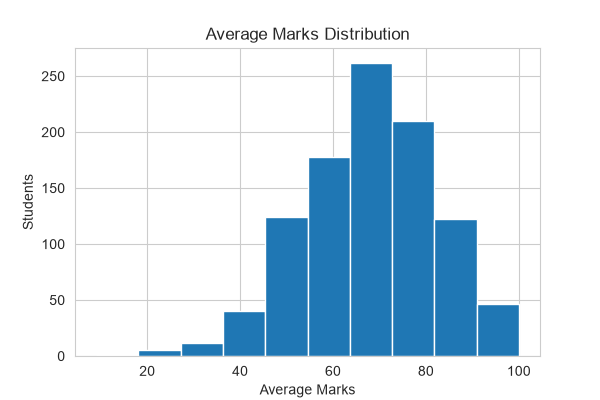
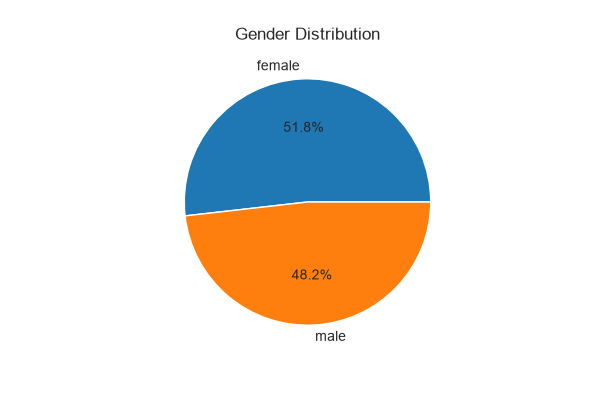
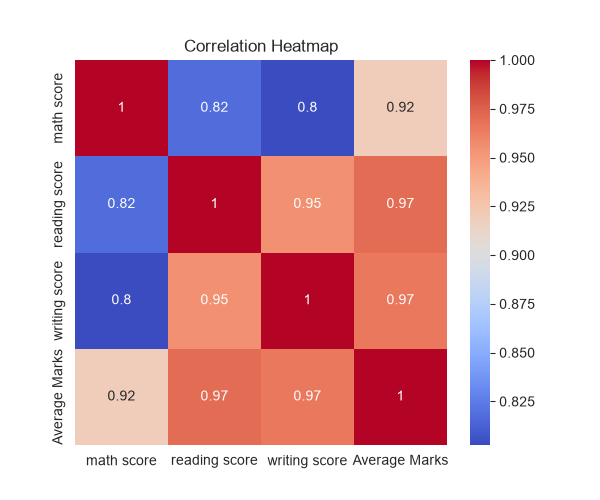
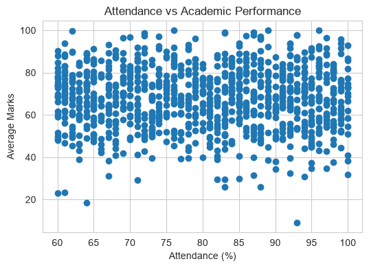

# Student Performance Analysis

## Project Overview

This project analyzes student academic performance data to identify patterns, trends, and relationships using Data Analytics techniques.

This project is completed as part of the Cognevance Technologies Data Science & Data Analytics Internship.

## Objectives

- Analyze student academic performance data
- Clean and preprocess the dataset
- Study marks and performance trends
- Create data visualizations
- Generate insights and recommendations

## Dataset
Dataset Source:

Kaggle - Students Performance Dataset

The dataset contains student academic details such as:

- Gender
- Mathematics Score
- Reading Score
- Writing Score
- Average Marks
- Attendance

## Tools and Technologies Used

- Python
- Pandas
- NumPy
- Matplotlib
- Seaborn
- Jupyter Notebook
- GitHub

## Project Workflow

1. Data Collection
2. Data Cleaning and Preprocessing
3. Exploratory Data Analysis
4. Data Visualization
5. Insights Generation
6. Report Preparation

## Visualizations Created

- Average Marks by Gender (Bar Chart)
- Average Marks Distribution (Histogram)
- Gender Distribution (Pie Chart)
- Correlation Heatmap

## Key Insights

- Student performance patterns were analyzed using visualization techniques.
- Different subjects show relationships with overall performance.
- Performance trends can help identify improvement areas.

## Recommendations

- Encourage regular attendance.
- Provide additional support for low-performing students.
- Conduct regular assessments.

## Project Structure

Student-Performance-Analysis
│
├── Dataset
│   └── cleaned_student_performance.csv
│
├── Notebook
│   └── Student_Performance_Analysis.ipynb
│
├── Charts
│   ├── Attendance_vs_Performance.png
│   ├── Average_Marks_by_Gender.png
│   ├── Average_Marks_Distribution.png
│   ├── Gender_Distribution.png
│   └── Correlation_Heatmap.png
│
├── Report
│   └── Student_Performance_Analysis_Report.docx
│
└── README.md

## Author

**Rakshitha K C**

Data Science & Data Analytics Intern  
Cognevance Technologies

## How to Run the Project

1. Clone the repository

2. Install required libraries:

pip install pandas numpy matplotlib seaborn jupyter

3. Open Jupyter Notebook:

jupyter notebook

4. Run Student_Performance_Analysis.ipynb

## Future Improvements

- Use real attendance data instead of generated values.
- Apply Machine Learning models for performance prediction.
- Create an interactive dashboard using Power BI.
- Analyze more student factors affecting performance.

## Project Visualizations

### Average Marks by Gender

### Average Marks Distribution

### Gender Distribution

### Correlation Heatmap

### Attendance vs Academic Performance

